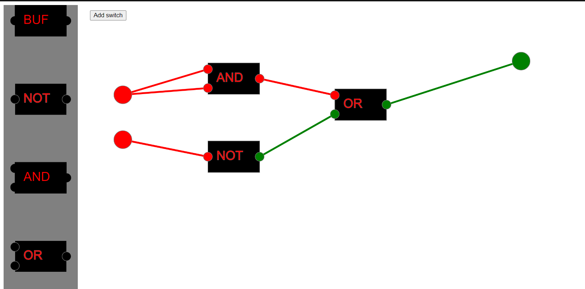

# Logic Gates

Tool for designing and simulating digital logic circuits.
Based on primitive logic gates it allows creating more complex structure

### Theory

[Logic gates on wiki](https://en.wikipedia.org/wiki/Logic_gate)

### Overview

You can add different gates on playground and connect them together

Area on the left is a place where you can grab new gate and add it to playground 
To add new input switch (on the left), click "Add switch" button 

To delete connection, click on gate input with connection to delete 
To delete gate, right click on it 
To delete input switch (on the left), right click on it  

### How to run

You can use build folder to run js or transpile ts to js by yourself

### Technologies used in this project

* Typescript
* Webpack
* P5.js (Processing) - drawing and rendering lib

### Features to implement in the future

* Creating custom gate (e.g. register) and save it as a gate with inputs and outputs
* Scrolling playground to make it infinite
* Smooth lines for connections

### Credits
This project is inspired by videos made by Sebastian Lague [Exploring How Computers Work](https://www.youtube.com/watch?v=QZwneRb-zqA&t=574s&ab_channel=SebastianLague) and [How Do Computers Remember?](https://www.youtube.com/watch?v=I0-izyq6q5s&t=4s&ab_channel=SebastianLague)
and his tool, he made to visualize logic circuits